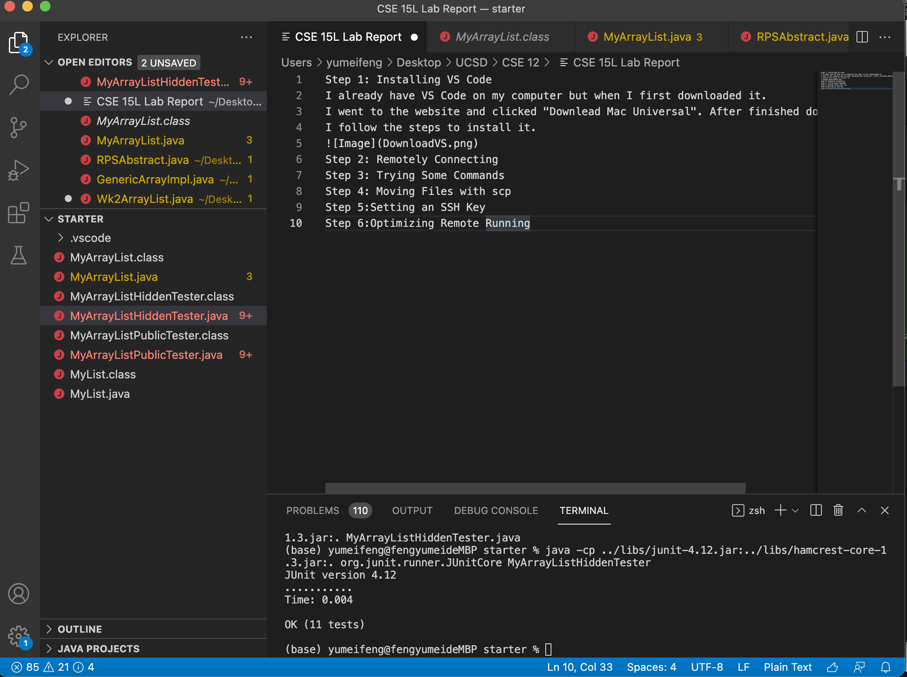

Step 1: Installing VS Code 
I already have VS Code on my computer but when I first downloaded it. 
I went to the website and clicked "Downlead Mac Universal". After finished downloading,
I follow the steps to install it. 

Step 2: Remotely Connecting
Step 3: Trying Some Commands
Step 4: Moving Files with scp
Step 5:Setting an SSH Key
Step 6:Optimizing Remote Running
