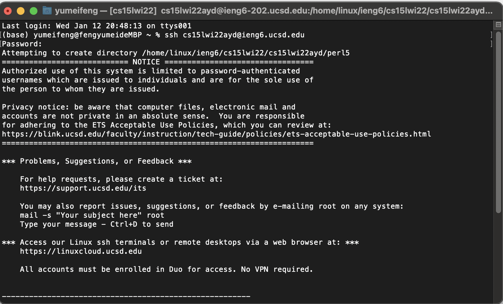
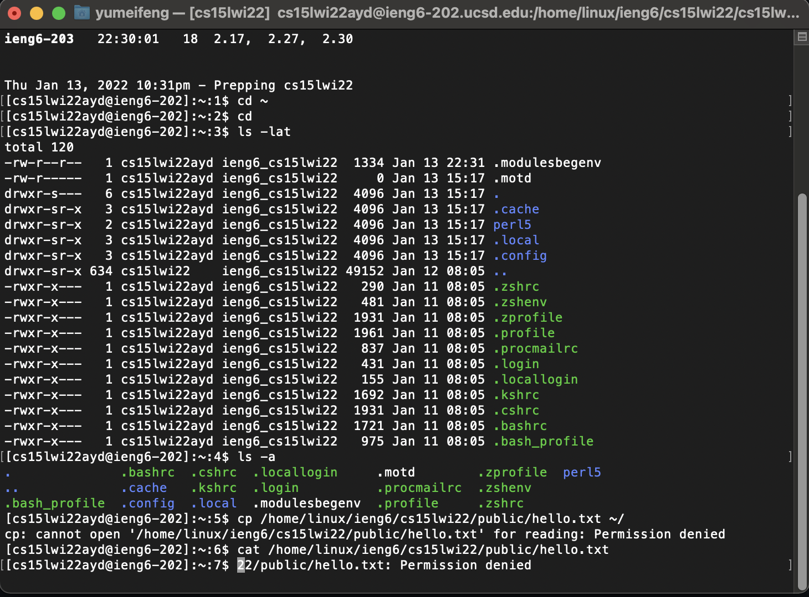
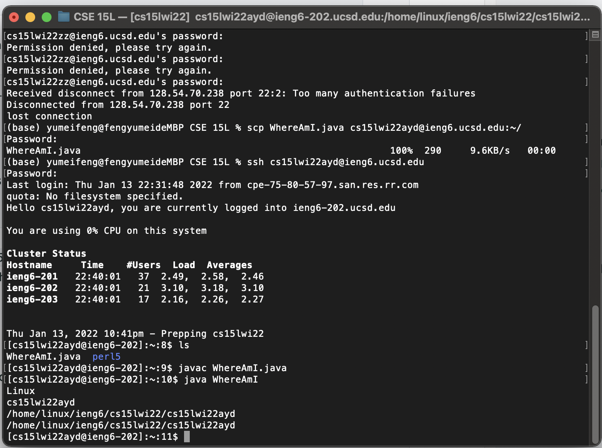
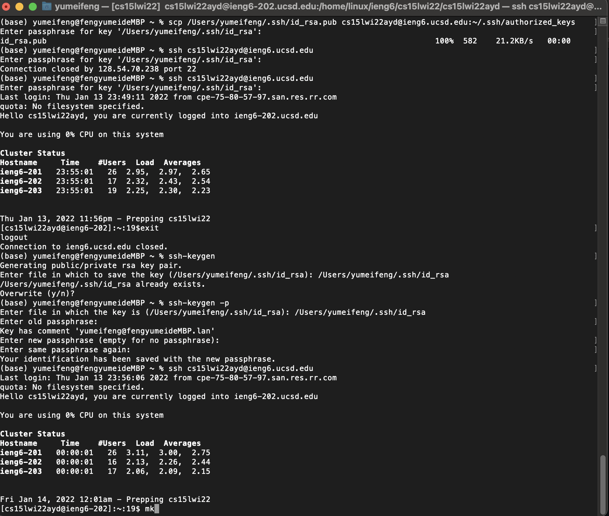
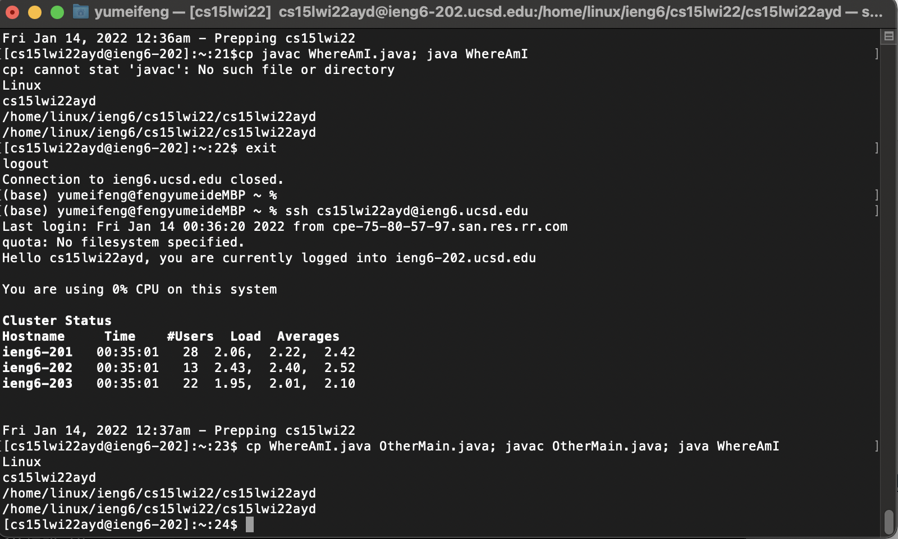

**Step 1: Installing VS Code**

Go to the [VS Code website](https://code.visualstudio.com) and clicked "Download Mac Universal". After finished downloading, follow the steps to install it on your computer. 
@ieng6.ucsd.edu` command to the terminal. It will shows that you are connected to the remote server.

**Step 3: Trying Some Commands**

Run the commands `cd, cd~, ls -lat`, some will leads to a particular directory path and some commands shows as permission denied. It's probably because you don't have access to these files in the remote server. 

**Step 4: Moving Files with scp**

Created the WhereAmI java file and use the `scp WhereAmI.java cs15lwi22zz@ieng6.ucsd.edu:~/` command to move the files to the remote server. Wait until it shows that the trasfer is compelte. Then use the ls command to make sure that the file is successfully transfered. 

**Step 5:Setting an SSH Key**

First generate a SSH key pair and saved it to your computer. Then use the  `scp` command to copy the key to the server and then try to log in without password.  

**Step 6:Optimizing Remote Running**

Use the `ssh cs15lwi22@ieng6.ucsd.edu ls` command and it will log onto the remote server and display the files in the directory. 

