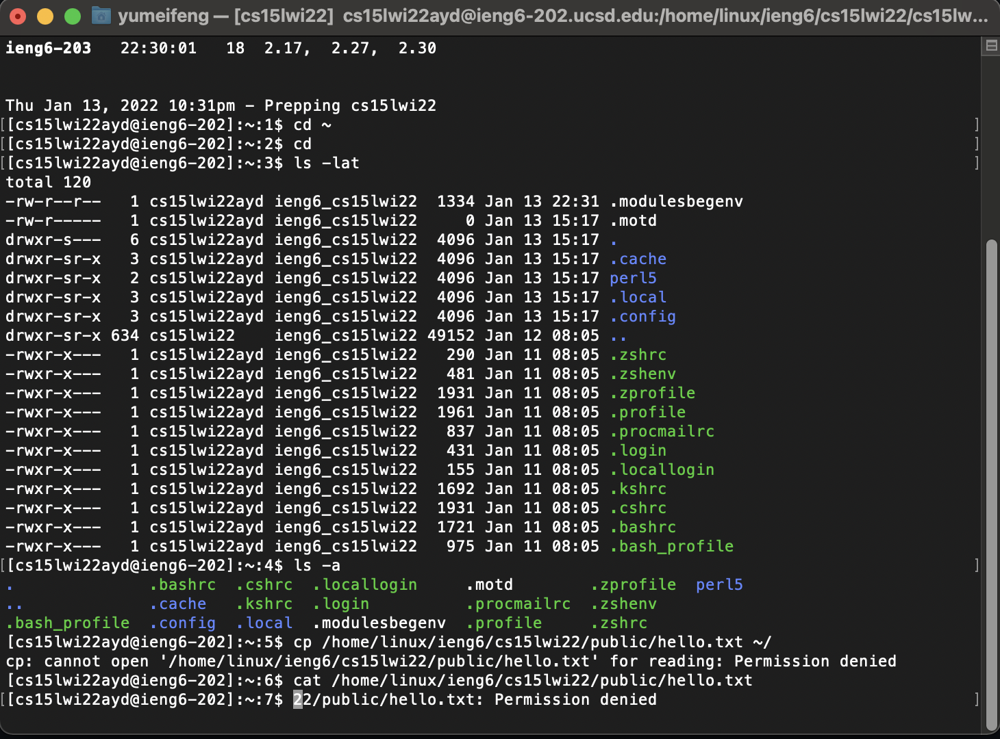
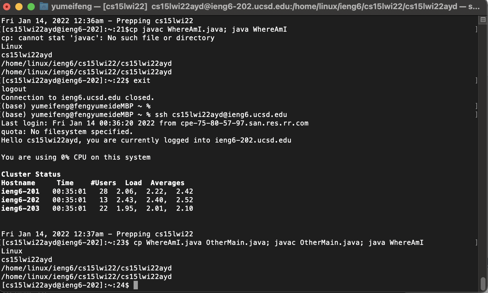

**Step 1: Installing VS Code**

I already have VS Code on my computer but when I first downloaded it. 
I went to the website and clicked "Downlead Mac Universal". After finished downloading,
I follow the steps to install it. 

**Step 2: Remotely Connecting**

I looked up my account on the website, and enter the "ssh cs15lwi22ayd@ieng6.ucsd.edu" command to my terminal 

**Step 3: Trying Some Commands**

I ran the commands and some leads to a particular directory path and the cp and cat shows as permission denied. I think it's because I don't have access to these files in the remote server. 

**Step 4: Moving Files with scp**

I created the java file and use the scp command to move my files to the remote server. Wait until it shows that the trasfer is compelte. The I use the ls command to make sure that the file is successfully transfered. 

**Step 5:Setting an SSH Key**

First I generated a SSH key pair and saved it to my computer. Then I use scp to copy the key to the server and then try to log in without password.  

**Step 6:Optimizing Remote Running**

I tried to use the ls command on the remote server. It logged me into the remote server and displayed the files. 

